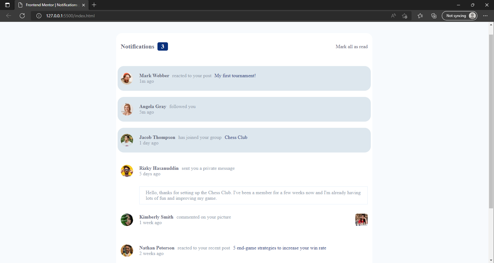
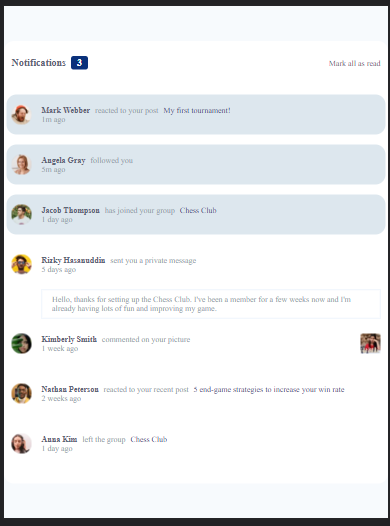
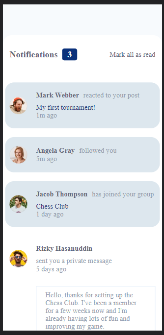

# Frontend Mentor - Notifications page solution

This is a solution to the [Notifications page challenge on Frontend Mentor](https://www.frontendmentor.io/challenges/notifications-page-DqK5QAmKbC). Frontend Mentor challenges help you improve your coding skills by building realistic projects. 

## Table of contents

- [Overview](#overview)
  - [The challenge](#the-challenge)
  - [Screenshot](#screenshot)
  - [Links](#links)
- [My process](#my-process)
  - [Built with](#built-with)
  - [What I learned](#what-i-learned)
  - [Continued development](#continued-development)
  - [Useful resources](#useful-resources)
- [Author](#author)
- [Acknowledgments](#acknowledgments)

**Note: Delete this note and update the table of contents based on what sections you keep.**

## Overview

### The challenge

Users should be able to:

- Distinguish between "unread" and "read" notifications
- Select "Mark all as read" to toggle the visual state of the unread notifications and set the number of unread messages to zero
- View the optimal layout for the interface depending on their device's screen size
- See hover and focus states for all interactive elements on the page

### Screenshot






**Note: Delete this note and the paragraphs above when you add your screenshot. If you prefer not to add a screenshot, feel free to remove this entire section.**

### Links


## My process

### Built with

- Semantic HTML5 markup
- CSS custom properties
- Flexbox
- CSS Grid
- Desktop-first workflow
- JavaScript

**Note: These are just examples. Delete this note and replace the list above with your own choices**

### What I learned

i learned about using margin with the css display property of flex

```css
.notificationMessages{
    width: 100%;   
    margin: 10px 0;
    display: flex;
    gap: 20px;
    align-items: center;
    padding: 20px 10px;
    border-radius: 20px;
    cursor: pointer;
}
.notificationMessages .comment{
    margin-left: auto;
}
```
```js
function messagePasser(messageObj) {
    let privateDiv = document.createElement('div')
    privateDiv.classList.add('private')
    if (messageObj.type === 'reacted') {
        privateDiv.innerHTML = `
        <div class="${messageObj.read ? 'notificationMessages': 'notificationMessages active'}">
        
        <div class="msg">
          <div class="notificationMsg">
            <span class="name">${messageObj.name}</span>
            <p>${messageObj.post}</p>
            <span class="extraDetail">${messageObj.postReactedTo}</span>
          </div>
          <span class="timeAgo">${messageObj.time}</span>
        </div>
        </div>
        `
        notificationBottom.appendChild(privateDiv)
    }else if(messageObj.type === 'follow'){
        privateDiv.innerHTML = `
        <div class="${messageObj.read ? 'notificationMessages': 'notificationMessages active'}">
        
        <div class="msg">
          <div class="notificationMsg">
            <span class="name">${messageObj.name}</span>
            <p>${messageObj.post}</p>
          </div>
          <span class="timeAgo">${messageObj.time}</span>
        </div>
        </div>
        `
        notificationBottom.appendChild(privateDiv)
    }else if(messageObj.type === 'inform'){
        privateDiv.innerHTML = `
        <div class="${messageObj.read ? 'notificationMessages': 'notificationMessages active'}">
        
        <div class="msg">
          <div class="notificationMsg">
            <span class="name">${messageObj.name}</span>
            <p>${messageObj.post}</p>
            <span class="extraDetail">${messageObj.postReactedTo}</span>
          </div>
          <span class="timeAgo">${messageObj.time}</span>
        </div>
        </div>
        `
        notificationBottom.appendChild(privateDiv)
    }else if(messageObj.type === 'private') {
        privateDiv.innerHTML = `
        <div class="${messageObj.read ? 'notificationMessages': 'notificationMessages active'}">
          
          <div class="msg">
          <div class="notificationMsg">
            <span class="name">${messageObj.name}</span>
            <p>${messageObj.post}</p>
          </div>
          <span class="timeAgo">${messageObj.time}</span>
          </div>
        </div>
        <div class="privateMsg">
          <p>${messageObj.message}</p>
        </div>
        `
        notificationBottom.appendChild(privateDiv)
    }else if(messageObj.type === 'comment'){
        privateDiv.innerHTML=`
        <div class="${messageObj.read ? 'notificationMessages': 'notificationMessages active'}">
        
        <div class="msg">
          <div class="notificationMsg">
            <span class="name">${messageObj.name}</span>
            <p>${messageObj.post}</p>
          </div>
          <span class="timeAgo">${messageObj.time}</span>
        </div>
        
        </div>
        </div>
        `
        notificationBottom.appendChild(privateDiv)
    }
}
```

If you want more help with writing markdown, we'd recommend checking out [The Markdown Guide](https://www.markdownguide.org/) to learn more.

**Note: Delete this note and the content within this section and replace with your own learnings.**

### Continued development

I want to focus on developing my javascript and learning and perfecting the react framework

**Note: Delete this note and the content within this section and replace with your own plans for continued development.**


## Author

- Frontend Mentor - [@martinnkemakolam](https://www.frontendmentor.io/profile/martinnkemakolam)
- Twitter - [@MartinNkemakol1](https://www.twitter.com/MartinNkemakol1)

**Note: Delete this note and add/remove/edit lines above based on what links you'd like to share.**

## Acknowledgments
I give a big thanks to Dibri who showed me the challenge and guided me through it 

**Note: Delete this note and edit this section's content as necessary. If you completed this challenge by yourself, feel free to delete this section entirely.**
